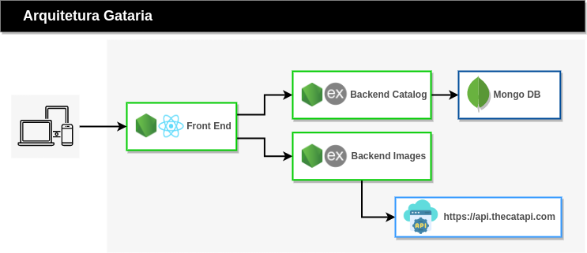

# GATARIA

Este Sistema de doação e adoção de gatos baseado em microsserviços foi um sistema desenvolvido por mim, para ser usado em um treinamento Bootcamp que  implantaria um ciclo DevOps neste sistema. Link do Bootcamp: https://www.udemy.com/course/raw-devops-bootcamp/

OBS: Este sistema foi usado para a criação das aulas, o sistema finalizado 100%, é de propriedade da empresa Raw DevOps a qual solicitou meus serviços como desenvolvedora, aqui consta somente a versão clean do sistema que foi desenvolvido por mim, com a autorização da empresa para apresentá-lo na matéria de desenvolvimento full stack.

# MERN Stack

Este sistema foi construído utilizando a MERN Stack.

.webp)

# ARQUITETURA

# Ferramentas Necessárias

- git: Sistema de controle de versão distribuído mais famoso do mundo. O Github utiliza ele.
- NodeJS
- VSCode

# Gataria Frontend

O microsserviço responsável pelo frontend. O mesmo foi desenvolvido em NodeJS utilizando o framework REACT.

- npm install Baixar e instalar as dependências necessárias.

- npm start Iniciar a aplicação.

# Gataria Backend Catalog

Para iniciar o primeiro microsserviço de backend: Catalog. Que é o responsável por todas as operações com o MongoDB. O mesmo foi desenvolvido utilizando o framework Express do NodeJS.

- Cadastrar uma conta em https://www.mongodb.com/cloud/atlas/register

- Agora vamos criar o nosso Database, e obter as credenciais de acesso.

- Vamos setar as variáveis de ambiente e iniciar o código:

- npm install

- npm start

# Gataria Backend Images
 microsserviço de backend: Images. Responsável por fazer requisições para a api externa The Cat API. O mesmo também foi desenvolvido com Express e nodejs.

- setar as variáveis de ambiente e iniciar o código:

- npm install

- npm start